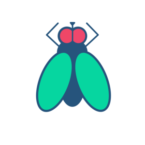

# Procrstinator Helper
- [Procrstinator Helper](#procrstinator-helper)
  - [What is it?](#what-is-it)
  - [Why a fly as logo?](#why-a-fly-as-logo)
  - [Usage](#usage)
  - [How to contribute](#how-to-contribute)
  

   

## What is it?
Simple web app used to give you some suggestion on how to spend your time while procrastinating. 
Is it useful? ABSOLUTELY NOT. 
The app itself is the result of a procrastination session.

## Why is there a fly as logo?
I personally desing the logo during another procrastination session. The choice of a fly is due to the Italian way of saying 'Guardare le mosche che volano', i.e. 'Look at the flies flying'. That is an action the only pro-level-procrastinator can do, since they only need their surroundings to waste time. It's bad, I know. 

## Usage
Just visit <https://www.procrastination-helper.com> and push the button! If you are a good procrastinator, you should push the button until you discover all the possible suggestions!

## How to contribute
If you want to contribute, you probably procrastinate more than me.
Just open a pull request and I'll be happy to loose my time with you.

